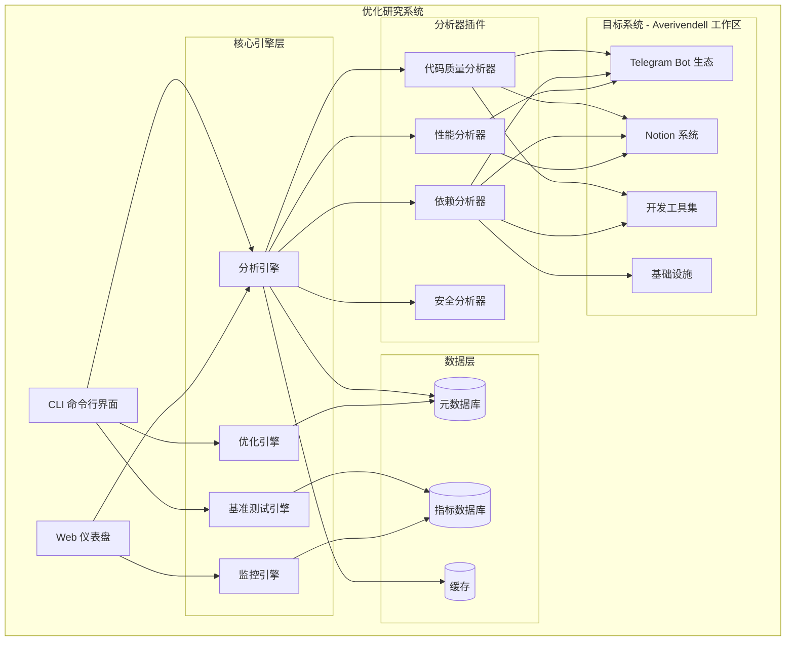
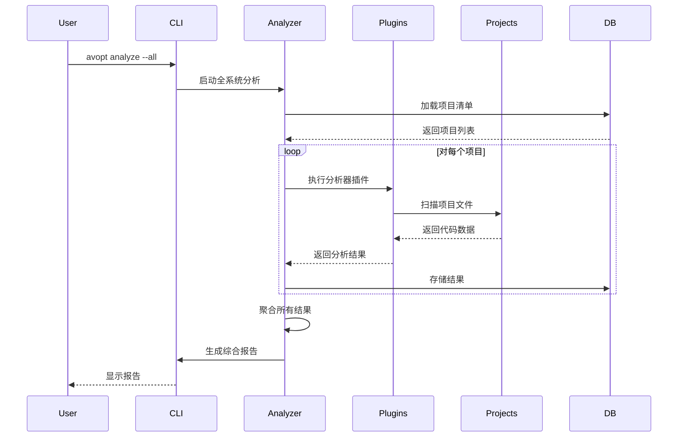
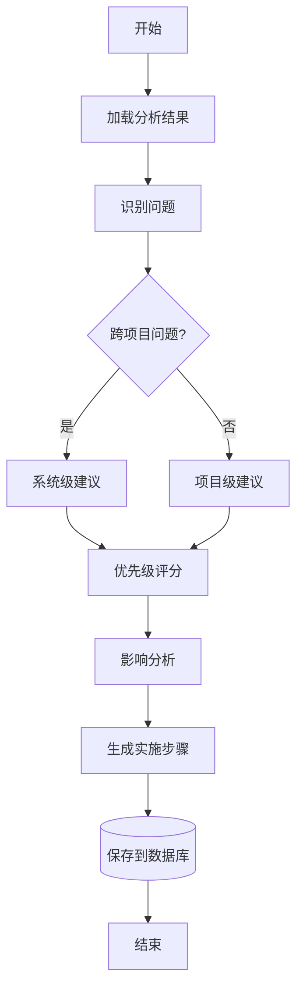
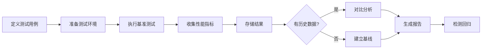

# Averivendell 系统优化研究项目 - 架构文档

## 1. 系统架构概览

### 1.1 整体架构图



### 1.2 组件职责

#### 1.2.1 核心引擎层

**分析引擎 (Analyzer)**
- 协调各类分析器的执行
- 聚合分析结果
- 生成分析报告
- 管理分析任务队列

**优化引擎 (Optimizer)**
- 基于分析结果生成优化建议
- 优先级评分和排序
- 优化方案验证
- 实施路线图生成

**基准测试引擎 (Benchmark)**
- 设计和执行性能测试
- 收集性能指标
- 对比和趋势分析
- 回归检测

**监控引擎 (Monitor)**
- 实时性能监控
- 异常检测和告警
- 日志收集和分析
- 健康检查

#### 1.2.2 分析器插件

**代码质量分析器 (CodeAnalyzer)**
- 代码复杂度分析（圈复杂度、认知复杂度）
- 代码重复检测
- 代码风格检查
- 测试覆盖率统计
- 技术债务评估

**依赖分析器 (DepAnalyzer)**
- package.json / requirements.txt 解析
- 依赖关系图构建
- 循环依赖检测
- 过时依赖识别
- 许可证合规性检查

**性能分析器 (PerfAnalyzer)**
- 启动时间分析
- 内存使用分析
- CPU 使用分析
- I/O 性能分析
- 瓶颈识别

**安全分析器 (SecAnalyzer)**
- 已知漏洞扫描
- 敏感信息检测（hardcoded secrets）
- 依赖漏洞检查
- 安全最佳实践验证

## 2. 数据模型

### 2.1 项目元数据模型

```javascript
{
  "projectId": "telegram-botManagement",
  "name": "Telegram Bot Management System",
  "type": "telegram-bot",
  "path": "/home/averyubuntu/projects/telegram-botManagement",
  "language": "javascript",
  "framework": "node.js",
  "dependencies": [
    { "name": "node-telegram-bot-api", "version": "^0.61.0" }
  ],
  "metrics": {
    "loc": 5000,
    "files": 50,
    "complexity": 25.5
  },
  "lastAnalyzed": "2025-11-09T13:55:00Z"
}
```

### 2.2 分析结果模型

```javascript
{
  "analysisId": "uuid",
  "projectId": "telegram-botManagement",
  "analyzerType": "code-quality",
  "timestamp": "2025-11-09T13:55:00Z",
  "results": {
    "complexity": {
      "average": 8.5,
      "max": 45,
      "violations": [
        {
          "file": "src/bot-manager.js",
          "function": "handleMessage",
          "complexity": 45,
          "recommendation": "Refactor into smaller functions"
        }
      ]
    },
    "duplication": {
      "percentage": 5.2,
      "blocks": []
    }
  },
  "score": 75
}
```

### 2.3 优化建议模型

```javascript
{
  "recommendationId": "uuid",
  "projectId": "telegram-botManagement",
  "category": "architecture",
  "priority": "high",
  "title": "Extract common bot utilities to shared library",
  "description": "Multiple bot projects duplicate utility functions",
  "impact": {
    "effort": "medium",
    "benefit": "high",
    "risk": "low"
  },
  "steps": [],
  "status": "pending"
}
```

## 3. 核心工作流

### 3.1 系统分析工作流



### 3.2 优化建议生成流程



### 3.3 基准测试流程



## 4. 技术栈

### 4.1 后端

**主要语言**: Node.js + TypeScript

**核心库**:
- **分析**: `eslint`, `jscpd`（重复代码检测）, `plato`（复杂度）
- **依赖**: `npm-check`, `depcheck`, `madge`（依赖图）
- **性能**: `clinic.js`, `autocannon`（负载测试）
- **安全**: `npm audit`, `snyk`

**数据存储**:
- SQLite（元数据和结果存储）
- Redis（缓存）

### 4.2 前端（仪表盘）

- React + TypeScript
- D3.js / Recharts（数据可视化）
- Tailwind CSS（样式）

### 4.3 CLI

- Commander.js（命令行解析）
- Inquirer.js（交互式提示）
- Chalk（彩色输出）
- Ora（进度指示器）

## 5. 插件系统架构

### 5.1 插件接口

```typescript
interface Analyzer {
  name: string;
  version: string;
  
  // 插件能分析的项目类型
  supports(project: Project): boolean;
  
  // 执行分析
  analyze(project: Project): Promise<AnalysisResult>;
  
  // 配置验证
  validateConfig(config: any): boolean;
}
```

### 5.2 插件注册和发现

```typescript
class AnalyzerRegistry {
  private analyzers: Map<string, Analyzer> = new Map();
  
  register(analyzer: Analyzer): void {
    this.analyzers.set(analyzer.name, analyzer);
  }
  
  getApplicableAnalyzers(project: Project): Analyzer[] {
    return Array.from(this.analyzers.values())
      .filter(a => a.supports(project));
  }
}
```

## 6. 部署架构

### 6.1 本地运行模式

```
┌─────────────────────────────────────┐
│   开发机器 (WSL/Linux)              │
│                                     │
│   ┌─────────────────────────────┐  │
│   │  优化研究工具                │  │
│   │  - CLI                       │  │
│   │  - 分析引擎                  │  │
│   │  - 数据库（SQLite）          │  │
│   └─────────────────────────────┘  │
│              │                      │
│              ▼                      │
│   ┌─────────────────────────────┐  │
│   │  Averivendell 子项目        │  │
│   │  - telegram-*                │  │
│   │  - notion_*                  │  │
│   │  - 开发工具                  │  │
│   └─────────────────────────────┘  │
└─────────────────────────────────────┘
```

### 6.2 Web 仪表盘模式

```
┌──────────────┐       ┌──────────────────┐
│   浏览器     │──────▶│  Web 服务器      │
└──────────────┘       │  (Express)        │
                       └────────┬──────────┘
                                │
                       ┌────────▼──────────┐
                       │  监控引擎         │
                       │  WebSocket        │
                       └────────┬──────────┘
                                │
                       ┌────────▼──────────┐
                       │  数据库           │
                       │  (SQLite + Redis) │
                       └───────────────────┘
```

## 7. 安全考虑

### 7.1 数据隐私
- 所有分析在本地执行，不上传代码到外部服务
- 敏感信息（API tokens）自动过滤
- 分析结果可选择性导出

### 7.2 权限管理
- 只读访问被分析的项目
- 明确的文件访问白名单
- 执行优化建议需要明确确认

## 8. 扩展性设计

### 8.1 水平扩展
- 分析任务可并行执行
- 支持分布式基准测试
- 结果聚合支持多节点

### 8.2 垂直扩展
- 插件化分析器
- 可配置的分析深度
- 增量分析支持

## 9. 监控和日志

### 9.1 系统日志
- 分析执行日志
- 性能指标日志
- 错误和异常日志

### 9.2 审计日志
- 优化建议应用记录
- 配置变更记录
- 访问日志

---

**文档版本**: 1.0  
**创建日期**: 2025-11-09  
**最后更新**: 2025-11-09
