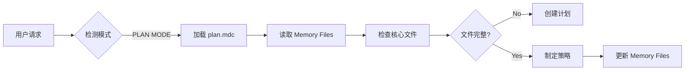
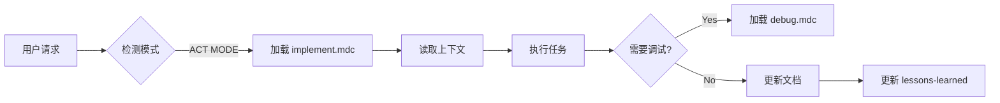

# Clinerules 规则文件连接机制详解

## 📋 概述

Clinerules 是一个多层次的规则系统，通过特定的连接机制将不同规则文件组织成一个有机整体。本文档详细说明这些规则文件如何互相连接、引用和协同工作。

---

## 🏗️ 系统架构

### 三层规则结构

```
┌─────────────────────────────────────────┐
│  Global Rules                            │
│  /home/averyubuntu/Cline/Rules/         │
│  - 跨项目通用方法论                      │
│  - 全局经验和最佳实践                    │
└─────────────┬───────────────────────────┘
              │
              ▼
┌─────────────────────────────────────────┐
│  Workspace Rules                         │
│  <project>/.clinerules/                  │
│  - 项目特定规则和配置                    │
│  - 扩展和定制 Global Rules               │
└─────────────┬───────────────────────────┘
              │
              ▼
┌─────────────────────────────────────────┐
│  Cursor IDE Rules                        │
│  <project>/.cursor/rules/                │
│  - IDE 级别的项目智能                    │
│  - 错误文档和经验教训                    │
└─────────────────────────────────────────┘
```

---

## 🔗 核心连接机制

### 1. MDC 引用机制（Markdown Context Links）

#### 基本语法

```markdown
[显示文本](mdc:相对路径)
```

#### 引用类型

**1.1 文件引用**
```markdown
[product_requirement_docs.md](mdc:docs/product_requirement_docs.md)
[architecture.md](mdc:docs/architecture.md)
[lessons-learned.mdc](mdc:.cursor/rules/lessons-learned.mdc)
```

**1.2 目录引用（使用 @ 符号）**
```markdown
@docs/literature
@tasks/rfc/
@tools/_registry.mdc
```

**1.3 跨规则引用**
```markdown
# 在 memory.mdc 中引用其他规则
[lessons-learned.mdc](mdc:.cursor/rules/lessons-learned.mdc)
[error-documentation.mdc](mdc:.cursor/rules/error-documentation.mdc)
```

#### 引用解析规则

1. **相对路径**: 从当前项目根目录开始
2. **自动解析**: Cline/Cursor 自动解析 `mdc:` 协议
3. **上下文加载**: 点击链接时加载相关文件到 AI 上下文

---

### 2. Frontmatter 元数据机制

每个 `.mdc` 文件开头的 YAML frontmatter 控制其加载行为。

#### 标准 Frontmatter 格式

```yaml
---
description: 规则文件的简短描述
globs: 文件匹配模式（可选）
alwaysApply: true/false
---
```

#### 关键字段说明

**2.1 `description`**
- **作用**: 说明规则用途，帮助 AI 理解何时使用
- **示例**:
  ```yaml
  description: "Always attach when Implementing Code (Act/Code MODE)"
  description: "ALWAYS INCLUDE to HAVE Project Context"
  ```

**2.2 `alwaysApply`**
- **作用**: 控制规则是否始终加载
- **值**:
  - `true`: 每次对话都自动加载（核心规则）
  - `false`: 按需加载（详细文档、工具说明等）

**示例对比**:
```yaml
# 核心规则 - 始终加载
---
description: Memory Files System Framework
alwaysApply: true
---

# 详细文档 - 按需加载
---
description: Rules Engine detailed documentation - load only when needed
alwaysApply: false
---
```

**2.3 `globs`**
- **作用**: 文件路径匹配模式，当操作特定文件时自动触发规则
- **语法**: 使用 glob 模式
- **示例**:
  ```yaml
  # 对所有 TypeScript 文件应用
  globs: "**/*.ts"
  
  # 对特定目录应用
  globs: "src/components/**"
  
  # 多个模式
  globs: 
    - "**/*.test.ts"
    - "**/*.spec.ts"
  ```

---

### 3. 分层加载机制

#### 加载顺序

```
1. Global Rules (alwaysApply: true)
   ├── plan.mdc / implement.mdc (根据模式)
   ├── rules.mdc
   ├── memory-framework.mdc
   ├── global-lessons-learned.mdc
   └── global-tools-registry.mdc

2. Workspace Rules (alwaysApply: true)
   ├── memory.mdc (扩展 memory-framework)
   ├── lessons-learned.mdc (项目特定)
   └── tools/_registry.mdc (项目工具)

3. 按需加载 (alwaysApply: false)
   ├── debug.mdc (when debugging)
   ├── architecture-understanding.mdc (when needed)
   ├── error-documentation.mdc (when needed)
   └── tools/<tool>.mdc (when needed)

4. Globs 匹配触发
   └── 当操作匹配文件时自动加载
```

#### 加载优先级

1. **Global 优先**: 全局规则先加载，提供基础框架
2. **Workspace 覆盖**: 工作区规则可以扩展或覆盖全局规则
3. **按需叠加**: 特定场景触发额外规则加载
4. **Globs 触发**: 文件操作自动触发相关规则

---

## 📚 核心文件及其连接

### Memory.mdc - 中央连接枢纽

`memory.mdc` 是整个系统的连接中心，它：

1. **定义 7 个核心文件**:
   ```markdown
   1. [product_requirement_docs.md](mdc:docs/product_requirement_docs.md)
   2. [architecture.md](mdc:docs/architecture.md)
   3. [technical.md](mdc:docs/technical.md)
   4. [tasks_plan.md](mdc:tasks/tasks_plan.md)
   5. [active_context.md](mdc:tasks/active_context.md)
   6. [error-documentation.mdc](mdc:.cursor/rules/error-documentation.mdc)
   7. [lessons-learned.mdc](mdc:.cursor/rules/lessons-learned.mdc)
   ```

2. **建立文件依赖关系**:
   ```mermaid
   flowchart TD
       PRD[product_requirement_docs.md] --> Tech[technical.md]
       PRD --> Arch[architecture.md]
       Tech --> Tasks[tasks_plan.md]
       Arch --> Tasks
       PRD --> Tasks
       Tasks --> Active[active_context.md]
       Active --> Errors[error-documentation.mdc]
       Active --> Lessons[lessons-learned.mdc]
   ```

3. **定义工作流模式**:
   - PLAN MODE 工作流
   - ACT MODE 工作流
   - 文档更新流程

---

### Tools Registry - 工具注册表

#### 两级工具注册

**Global Tools Registry**
```markdown
---
description: Global tools available across all projects
alwaysApply: true
---

## 全局工具
- Git MCP 工具
- GitHub MCP 工具
- 通用开发工具
```

**Project Tools Registry**
```markdown
---
description: Project tools registry - lightweight index
alwaysApply: true
---

## 项目工具
1. Rules Engine → 详见 @tools/rules-engine.mdc
2. Vibe Coding → 详见 @tools/vibe-coding.mdc
```

#### 轻量级索引 + 详细文档模式

**注册表文件** (alwaysApply: true, 轻量级):
- 列出所有可用工具
- 提供快速参考
- 包含常用命令

**详细文档** (alwaysApply: false, 按需加载):
- 完整的工具文档
- 架构说明
- API 参考
- 使用示例

**连接示例**:
```markdown
# 在 _registry.mdc 中
## 1. Rules Engine
快速调用: `cd /path && node src/index.js`
📚 详细文档: @tools/rules-engine.mdc

# 在 rules-engine.mdc 中
---
description: Rules Engine detailed documentation - load only when needed
alwaysApply: false
---
# Rules Engine - 详细文档
> ⚠️ 本文档按需加载。快速参考请查看 @tools/_registry.mdc
```

---

## 🔄 模式化工作流连接

### PLAN MODE 连接流程



**涉及的规则连接**:
1. `plan.mdc` (alwaysApply: true in PLAN MODE)
2. `memory.mdc` → 指向 7 个核心文件
3. `architecture.md` ← 架构规划
4. `tasks_plan.md` ← 任务分解

### ACT MODE 连接流程



**涉及的规则连接**:
1. `implement.mdc` (alwaysApply: true in ACT MODE)
2. `debug.mdc` (alwaysApply: false, 按需)
3. `memory.mdc` → 核心文件更新
4. `lessons-learned.mdc` ← 记录经验
5. `error-documentation.mdc` ← 记录错误

---

## 🎯 高级连接模式

### 1. 条件加载模式

**场景**: 根据上下文自动加载相关规则

```markdown
# 在 implement.mdc 中
<DEBUGGING>
Below debugging routine is for persistent errors...
# 触发加载 debug.mdc
</DEBUGGING>

# 在 memory.mdc 中
When triggered by **update memory files**, MUST review ALL Core Files
# 触发读取所有 7 个核心文件
```

### 2. 引用链模式

**场景**: 规则之间形成引用链

```
用户请求
  └→ memory.mdc (always loaded)
      ├→ product_requirement_docs.md (读取)
      ├→ architecture.md (读取)
      │   └→ architecture-understanding.mdc (按需加载)
      ├→ tasks_plan.md (读取)
      │   └→ tasks/rfc/*.tex (按需加载)
      └→ lessons-learned.mdc (读取)
          └→ 应用学到的模式
```

### 3. 双向同步模式

**场景**: 规则和文档双向更新

```markdown
# 在 memory.mdc 中定义
After every code implementation/change ALWAYS do 2 things:
a. Update other possibly affected codes
b. Update the documentation in docs/ and tasks/

# 在 implement.mdc 中响应
After every Plan/Architect task ALWAYS do 2 things:
a. Document the plan into existing documentation
b. Document the plans and related task planning
```

---

## 💡 实际应用示例

### 示例 1: 新项目初始化

**触发的连接链**:
```
1. 用户: "初始化新项目"
   ↓
2. 加载 plan.mdc (PLAN MODE)
   ↓
3. plan.mdc 引用 memory.mdc
   ↓
4. memory.mdc 定义 7 个核心文件
   ↓
5. 检查文件是否存在
   ↓
6. 如不存在 → 创建 product_requirement_docs.md
   ↓
7. 创建后 → 更新 tasks_plan.md
   ↓
8. 更新 active_context.md 记录状态
```

### 示例 2: 代码实现任务

**触发的连接链**:
```
1. 用户: "实现功能 X"
   ↓
2. 加载 implement.mdc (ACT MODE)
   ↓
3. implement.mdc → <ANALYZE CODE>
   ↓
4. 读取 architecture.md (via memory.mdc)
   ↓
5. 可能触发 architecture-understanding.mdc
   ↓
6. 实现代码
   ↓
7. 更新 tasks_plan.md
   ↓
8. 如有经验 → 更新 lessons-learned.mdc
   ↓
9. 如有错误 → 更新 error-documentation.mdc
```

### 示例 3: 使用项目工具

**触发的连接链**:
```
1. 用户: "使用 Vibe Coding 工具"
   ↓
2. 加载 tools/_registry.mdc (always loaded)
   ↓
3. 查看快速参考和常用命令
   ↓
4. 用户: "需要详细了解架构"
   ↓
5. AI 加载 @tools/vibe-coding.mdc (按需)
   ↓
6. 提供完整的架构和 API 文档
```

---

## 🔧 配置最佳实践

### 1. 核心规则设置

```yaml
# memory.mdc
---
description: ALWAYS INCLUDE to HAVE Project Context
globs: 
alwaysApply: true
---
```

**原因**: 
- 内存系统是基础，必须始终加载
- 不需要 globs（不针对特定文件）

### 2. 模式化规则设置

```yaml
# plan.mdc
---
description: Include these rules while PLANNING
globs: 
alwaysApply: true  # 在 PLAN MODE 时
---

# implement.mdc
---
description: Include these rules while IMPLEMENTATION
globs: 
alwaysApply: true  # 在 ACT MODE 时
---
```

### 3. 按需规则设置

```yaml
# debug.mdc
---
description: Include these rules while DEBUGGING
globs: 
alwaysApply: false
---

# tools/vibe-coding.mdc
---
description: Vibe Coding detailed documentation - load only when needed
globs: 
alwaysApply: false
---
```

**原因**: 
- 节省 token 和上下文空间
- 仅在需要时加载详细信息

### 4. 工具注册表设置

```yaml
# tools/_registry.mdc
---
description: Project tools registry - lightweight index
globs: 
alwaysApply: true
---
```

**原因**: 
- 轻量级，始终可见
- 作为详细文档的入口

---

## 📊 连接机制总结

### 连接类型对照表

| 连接类型 | 语法 | 用途 | 示例 |
|---------|------|------|------|
| MDC 文件引用 | `[text](mdc:path)` | 链接到其他文件 | `[arch](mdc:docs/architecture.md)` |
| MDC 目录引用 | `@path/` | 引用目录或注册表 | `@tools/_registry.mdc` |
| Frontmatter 控制 | `alwaysApply: true/false` | 控制加载时机 | 核心规则 vs 详细文档 |
| Globs 匹配 | `globs: "**/*.ts"` | 文件操作触发 | 针对特定文件类型 |
| 工作流模式 | PLAN/ACT MODE | 场景化加载 | 规划 vs 实现 |
| 引用链 | 文件 → 文件 | 建立依赖关系 | PRD → Architecture → Tasks |

### 设计原则

1. **分层清晰**: Global → Workspace → Cursor
2. **按需加载**: alwaysApply 控制加载时机
3. **轻重分离**: 注册表（轻）+ 详细文档（重）
4. **双向同步**: 规则 ↔ 文档保持一致
5. **模式驱动**: PLAN/ACT MODE 自动切换规则集

---

## 🚀 使用建议

### 对于项目维护者

1. **保持轻量级索引**
   - `_registry.mdc` 文件应简洁
   - 详细文档放在单独文件中

2. **合理使用 alwaysApply**
   - 核心框架: `true`
   - 详细文档: `false`

3. **建立清晰的引用链**
   - 使用 mdc 链接连接相关文件
   - 在 Mermaid 图中可视化关系

### 对于 AI 使用

1. **遵循加载顺序**
   - 先读 memory.mdc
   - 再根据模式加载 plan/implement
   - 最后按需加载详细文档

2. **理解引用机制**
   - 看到 `@` 引用时，查找对应文件
   - 看到 `mdc:` 链接时，理解为可点击加载

3. **更新同步**
   - 代码变更 → 更新文档
   - 文档变更 → 反映在规则中

---

## 📝 附录

### A. 完整的 MDC 引用示例

```markdown
# 核心文件引用
- [PRD](mdc:docs/product_requirement_docs.md)
- [架构](mdc:docs/architecture.md)
- [技术](mdc:docs/technical.md)

# 任务和上下文
- [任务计划](mdc:tasks/tasks_plan.md)
- [当前上下文](mdc:tasks/active_context.md)

# 项目智能
- [经验教训](mdc:.cursor/rules/lessons-learned.mdc)
- [错误记录](mdc:.cursor/rules/error-documentation.mdc)

# 工具和详细文档
- @tools/_registry.mdc
- @tools/rules-engine.mdc
- @tools/vibe-coding.mdc

# 可选上下文
- @docs/literature
- @tasks/rfc/
```

### B. Frontmatter 配置模板

```yaml
# 核心规则模板
---
description: 简短的规则描述（必填）
globs: 文件匹配模式（可选，留空表示不限文件）
alwaysApply: true  # 核心规则始终加载
---

# 详细文档模板
---
description: 详细文档说明 - 按需加载
globs: 
alwaysApply: false  # 仅在需要时加载
---

# 文件特定规则模板
---
description: 针对特定文件的规则
globs: "**/*.ts"  # 仅对 TypeScript 文件生效
alwaysApply: false  # 操作相关文件时触发
---
```

### C. 工具注册表模板

```markdown
---
description: Project tools registry - lightweight index
globs: 
alwaysApply: true
---

# 🛠️ 项目工具注册表

## 1. [工具名称]

**路径**: /path/to/tool
**类型**: Node.js/Python/Bash
**用途**: 简短描述

### 快速调用
```bash
常用命令示例
```

### 常用场景
1. 场景1 → 命令1
2. 场景2 → 命令2

### 📚 详细文档
参考：`@tools/[tool-name].mdc`

---

**注意**: 保持此文件轻量（< 1000 tokens）
```

---

**文档版本**: 1.0.0  
**创建日期**: 2025-11-09  
**最后更新**: 2025-11-09  
**状态**: Stable  
**维护者**: AI Assistant
