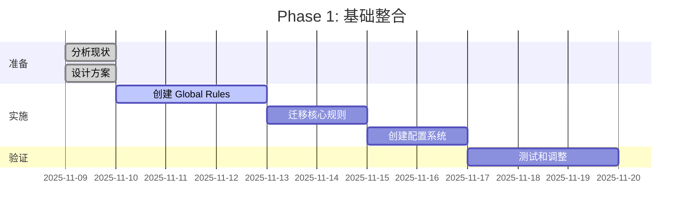

# Clinerules + Workflows 系统优化整合方案

## 📋 执行摘要

本文档提出一个全面的优化方案，整合 Clinerules 规则系统和 Workflows 工作流系统，建立统一、高效、易维护的 AI 辅助开发环境。

**优化目标**:
- 🔗 建立 Rules 与 Workflows 的有机连接
- 📚 统一文档和配置管理
- ⚡ 提高系统响应速度和效率
- 🛠️ 简化维护和扩展流程
- 🎯 优化用户体验

---

## 🏗️ 当前系统架构分析

### 1. 现有组件

```
┌─────────────────────────────────────────────────────────┐
│                    Cline/Cursor 环境                      │
├─────────────────────────────────────────────────────────┤
│                                                           │
│  ┌────────────────────────────────────────────┐          │
│  │  Clinerules 系统（规则和上下文）             │          │
│  │                                            │          │
│  │  • Global Rules (/Cline/Rules/)           │          │
│  │  • Workspace Rules (.clinerules/)         │          │
│  │  • Cursor Rules (.cursor/rules/)          │          │
│  └────────────────────────────────────────────┘          │
│                                                           │
│  ┌────────────────────────────────────────────┐          │
│  │  Workflows 系统（执行流程）                  │          │
│  │                                            │          │
│  │  • Global Workflows (workflows/)          │          │
│  │  • Workspace Workflows (.cline/workflows/)│          │
│  └────────────────────────────────────────────┘          │
│                                                           │
│  ┌────────────────────────────────────────────┐          │
│  │  Memory Files（项目知识库）                  │          │
│  │                                            │          │
│  │  • docs/ (架构、技术、PRD)                │          │
│  │  • tasks/ (任务、上下文)                  │          │
│  └────────────────────────────────────────────┘          │
│                                                           │
└─────────────────────────────────────────────────────────┘
```

### 2. 识别的问题

#### 🔴 高优先级问题

1. **Rules 和 Workflows 割裂**
   - Rules 定义"如何思考"
   - Workflows 定义"如何执行"
   - 但两者之间缺少连接机制

2. **Global Rules 尚未迁移**
   - 核心方法论仍在项目级别
   - 无法跨项目复用
   - 维护成本高

3. **文档分散**
   - 指南在 docs/guides/
   - 规则在 .clinerules/ 和 .cursor/rules/
   - Workflows 在完全不同的位置
   - 缺少统一索引

#### 🟡 中优先级问题

4. **加载策略不够智能**
   - alwaysApply 机制简单
   - 缺少条件加载
   - 无法根据任务类型优化加载

5. **工具和文档更新不同步**
   - tools/_registry.mdc 需要手动更新
   - 容易遗漏新工具
   - 文档和实际不一致

6. **缺少集中管理工具**
   - 规则管理靠手工
   - Workflows 管理靠文件系统
   - 没有可视化界面

#### 🟢 低优先级问题

7. **示例和模板不足**
   - 缺少标准化模板
   - 新项目初始化繁琐

8. **监控和调试困难**
   - 不清楚哪些规则被加载
   - 难以追踪工作流执行

---

## 🎯 优化方案设计

### 方案 1: Rules-Workflows 连接机制

#### 设计理念

```
Rules（思考层）→ Workflows（执行层）→ 结果
     ↓                    ↓
  定义策略           实施步骤
  提供上下文         调用工具
  指导决策           执行任务
```

#### 实现方法

**1.1 在 Rules 中引用 Workflows**

```markdown
# 在 implement.mdc 中
## SYSTEMATIC CODE PROTOCOL

[Step 1] <ANALYZE CODE>
...

[Step 2] <PLAN CODE>
...

[Step 3] <MAKE CHANGES>
- 可选: 使用 `/save.md` workflow 自动保存和提交
...
```

**1.2 在 Workflows 中引用 Rules**

```markdown
# save.md
# 保存并提交工作流

根据 @memory.mdc 中定义的文档更新规则：
- 更新 tasks/active_context.md
- 更新 tasks/tasks_plan.md  
- 如有经验教训，更新 .cursor/rules/lessons-learned.mdc

## 步骤 1: 检查必要的 Memory Files
...
```

**1.3 创建连接映射文件**

```yaml
# .clinerules/workflow-mappings.yaml
---
description: Rules to Workflows mapping
alwaysApply: false
---

# 规则 → 工作流映射

## ACT MODE Workflows
implement.mdc:
  - save.md: "保存代码修改"
  - test.md: "运行测试"
  - deploy.md: "部署服务"

## PLAN MODE Workflows  
plan.mdc:
  - design.md: "设计方案"
  - review.md: "方案审查"

## Debugging Workflows
debug.mdc:
  - diagnose.md: "诊断问题"
  - fix.md: "修复和验证"
```

---

### 方案 2: 统一配置管理系统

#### 2.1 中央配置文件

创建 `/home/averyubuntu/Cline/cline-config.yaml`:

```yaml
# Cline 全局配置
version: "1.0"
updated: "2025-11-09"

# 规则系统配置
rules:
  global_path: "/home/averyubuntu/Cline/Rules"
  workspace_path: ".clinerules"
  cursor_path: ".cursor/rules"
  
  # 加载策略
  loading_strategy:
    mode: "smart"  # always, smart, minimal
    cache_enabled: true
    max_context_tokens: 50000

# Workflows 配置
workflows:
  global_path: "~/.vscode-server/data/User/globalStorage/saoudrizwan.claude-dev/workflows"
  workspace_path: ".cline/workflows"
  
  # 别名系统
  aliases:
    save: "save.md"
    test: "run-tests.md"
    deploy: "deploy.md"

# Memory Files 配置
memory:
  core_files:
    - "docs/product_requirement_docs.md"
    - "docs/architecture.md"
    - "docs/technical.md"
    - "tasks/tasks_plan.md"
    - "tasks/active_context.md"
    - ".cursor/rules/error-documentation.mdc"
    - ".cursor/rules/lessons-learned.mdc"

# MCP 工具配置
mcp:
  servers:
    git: 
      enabled: true
      auto_approve: ["git_status", "git_log", "git_diff"]
    github:
      enabled: true
      auto_approve: ["search_repositories", "get_file_contents"]
```

#### 2.2 项目级配置继承

`.clinerules/project-config.yaml`:

```yaml
# 项目特定配置（继承全局配置）
extends: "global"

# 项目特定规则
rules:
  custom:
    - "architecture-understanding.mdc"
    
# 项目特定工作流
workflows:
  custom:
    - "project-specific-deploy.md"

# 项目工具
tools:
  - name: "rules-engine"
    path: "rules/"
  - name: "vibe-coding"
    path: "vibe-coding/"
```

---

### 方案 3: 智能加载系统

#### 3.1 上下文感知加载

```javascript
// 伪代码示例
class SmartLoader {
  async loadRulesForContext(context) {
    const rules = [];
    
    // 1. 始终加载核心规则
    rules.push(...this.loadCoreRules());
    
    // 2. 根据模式加载
    if (context.mode === 'PLAN') {
      rules.push(this.loadRule('plan.mdc'));
    } else if (context.mode === 'ACT') {
      rules.push(this.loadRule('implement.mdc'));
    }
    
    // 3. 根据任务类型加载
    if (context.taskType === 'debugging') {
      rules.push(this.loadRule('debug.mdc'));
    }
    
    // 4. 根据文件类型加载（globs）
    if (context.files.some(f => f.endsWith('.ts'))) {
      rules.push(this.loadRule('typescript-rules.mdc'));
    }
    
    // 5. 根据项目工具加载
    if (context.project.hasTools(['vibe-coding'])) {
      rules.push(this.loadRule('tools/vibe-coding.mdc'));
    }
    
    return this.optimizeLoadOrder(rules);
  }
}
```

#### 3.2 分级加载策略

```
Level 0: 核心框架（总是加载）
├── memory.mdc
├── rules.mdc
└── global-lessons-learned.mdc

Level 1: 模式相关（根据 PLAN/ACT 加载）
├── plan.mdc (PLAN MODE)
└── implement.mdc (ACT MODE)

Level 2: 任务相关（根据任务类型加载）
├── debug.mdc (debugging)
├── architecture-understanding.mdc (architecture work)
└── tools/_registry.mdc (tool usage)

Level 3: 详细文档（按需加载）
├── tools/rules-engine.mdc
├── tools/vibe-coding.mdc
└── docs/literature/*
```

---

### 方案 4: 文档体系重组

#### 4.1 新的目录结构

```
/home/averyubuntu/Cline/
├── Rules/                          # Global Rules
│   ├── core/
│   │   ├── memory-framework.mdc
│   │   ├── plan.mdc
│   │   ├── implement.mdc
│   │   ├── debug.mdc
│   │   └── rules.mdc
│   ├── tools/
│   │   └── global-tools-registry.mdc
│   ├── lessons/
│   │   └── global-lessons-learned.mdc
│   └── README.md
│
├── Workflows/                      # Global Workflows
│   ├── development/
│   │   ├── save.md
│   │   ├── test.md
│   │   └── deploy.md
│   ├── planning/
│   │   ├── design.md
│   │   └── review.md
│   ├── debugging/
│   │   ├── diagnose.md
│   │   └── fix.md
│   └── README.md
│
├── Docs/                           # 文档中心
│   ├── guides/
│   │   ├── CLINERULES_SETUP.md
│   │   ├── WORKFLOWS_SETUP.md
│   │   ├── SYSTEM_ARCHITECTURE.md
│   │   └── BEST_PRACTICES.md
│   ├── templates/
│   │   ├── rule-template.mdc
│   │   ├── workflow-template.md
│   │   └── project-template/
│   └── api/
│       ├── mdc-reference.md
│       └── workflow-syntax.md
│
└── cline-config.yaml              # 全局配置

<project>/
├── .clinerules/                   # Project Rules
│   ├── memory.mdc
│   ├── lessons-learned.mdc
│   ├── error-documentation.mdc
│   ├── directory-structure.mdc
│   ├── tools/
│   │   ├── _registry.mdc
│   │   └── [tool-docs].mdc
│   └── project-config.yaml
│
├── .cline/                        # Project Workflows
│   └── workflows/
│       └── [project-workflows].md
│
├── docs/                          # Memory Files
│   ├── product_requirement_docs.md
│   ├── architecture.md
│   ├── technical.md
│   └── guides/
│
└── tasks/
    ├── tasks_plan.md
    └── active_context.md
```

#### 4.2 文档索引系统

创建 `/home/averyubuntu/Cline/Docs/INDEX.md`:

```markdown
# Cline 系统文档索引

## 🎯 快速开始
- [系统架构](guides/SYSTEM_ARCHITECTURE.md)
- [Clinerules 设置](guides/CLINERULES_SETUP.md)
- [Workflows 设置](guides/WORKFLOWS_SETUP.md)

## 📚 核心概念
- [连接机制详解](guides/CLINERULES_CONNECTION_MECHANISM.md)
- [Memory Files 系统](guides/MEMORY_SYSTEM.md)
- [加载策略](guides/LOADING_STRATEGIES.md)

## 🔧 参考文档
- [MDC 语法参考](api/mdc-reference.md)
- [Workflow 语法参考](api/workflow-syntax.md)
- [配置文件参考](api/config-reference.md)

## 📝 模板
- [规则文件模板](templates/rule-template.mdc)
- [工作流模板](templates/workflow-template.md)
- [项目初始化模板](templates/project-template/)

## 🎓 最佳实践
- [Rules 设计模式](guides/RULES_PATTERNS.md)
- [Workflows 设计模式](guides/WORKFLOW_PATTERNS.md)
- [性能优化](guides/PERFORMANCE.md)
```

---

### 方案 5: 工具自动化

#### 5.1 Cline CLI 工具

创建 `/home/averyubuntu/Cline/bin/cline-cli.js`:

```javascript
#!/usr/bin/env node

const commands = {
  // 规则管理
  'rules:list': listRules,
  'rules:validate': validateRules,
  'rules:optimize': optimizeRules,
  
  // Workflows 管理
  'workflows:list': listWorkflows,
  'workflows:create': createWorkflow,
  'workflows:test': testWorkflow,
  
  // 项目管理
  'project:init': initProject,
  'project:sync': syncWithGlobal,
  'project:check': checkProjectHealth,
  
  // 系统管理
  'system:status': systemStatus,
  'system:update': updateSystem,
  'system:diagnose': diagnoseIssues,
};

// 示例使用
// cline-cli rules:list
// cline-cli project:init --template nodejs
// cline-cli system:diagnose
```

#### 5.2 自动化脚本

**规则同步脚本** (`/home/averyubuntu/Cline/scripts/sync-rules.sh`):

```bash
#!/bin/bash
# 同步 Global Rules 到所有项目

GLOBAL_RULES="/home/averyubuntu/Cline/Rules"
PROJECTS_DIR="/home/averyubuntu/projects"

# 查找所有有 .clinerules 的项目
find "$PROJECTS_DIR" -name ".clinerules" -type d | while read -r project_rules; do
    project_dir=$(dirname "$project_rules")
    echo "同步到: $project_dir"
    
    # 只同步核心规则，不覆盖项目特定规则
    cp "$GLOBAL_RULES/core/memory-framework.mdc" "$project_rules/" 2>/dev/null || true
done
```

**工具注册表自动更新** (`/home/averyubuntu/Cline/scripts/update-tool-registry.js`):

```javascript
#!/usr/bin/env node
// 扫描项目工具并自动更新 _registry.mdc

const fs = require('fs');
const path = require('path');

function scanTools(projectDir) {
  const toolsDir = path.join(projectDir, 'tools');
  const tools = [];
  
  // 扫描工具目录
  if (fs.existsSync(toolsDir)) {
    const entries = fs.readdirSync(toolsDir);
    for (const entry of entries) {
      const toolPath = path.join(toolsDir, entry);
      if (fs.statSync(toolPath).isDirectory()) {
        tools.push({
          name: entry,
          path: toolPath,
          // 读取 package.json 或 README 获取更多信息
        });
      }
    }
  }
  
  return tools;
}

function updateRegistry(projectDir, tools) {
  const registryPath = path.join(projectDir, '.clinerules/tools/_registry.mdc');
  
  // 生成新的注册表内容
  let content = `---
description: Project tools registry - auto-generated
globs: 
alwaysApply: true
updated: ${new Date().toISOString()}
---

# 🛠️ 项目工具注册表

> ⚠️ 此文件由 update-tool-registry.js 自动生成

`;

  tools.forEach((tool, index) => {
    content += `
## ${index + 1}. ${tool.name}

**路径**: ${tool.path}

📚 详细文档: @tools/${tool.name}.mdc

---
`;
  });
  
  fs.writeFileSync(registryPath, content);
  console.log(`✅ 已更新 ${registryPath}`);
}

// 使用
// node update-tool-registry.js /home/averyubuntu/projects
```

---

### 方案 6: Rules-Workflows 集成模式

#### 6.1 工作流模板系统

**模板文件**: `/home/averyubuntu/Cline/Workflows/templates/act-mode-template.md`

```markdown
# {WORKFLOW_NAME}

> 这是一个 ACT MODE 工作流模板

## 前置条件检查

参考 @memory.mdc 确保以下文件存在：
- [ ] docs/architecture.md
- [ ] tasks/tasks_plan.md
- [ ] tasks/active_context.md

## 步骤 1: 分析需求

根据 @implement.mdc 的 <ANALYZE CODE> 指南：
- 分析代码依赖
- 评估影响范围

## 步骤 2: 实施修改

遵循 @implement.mdc 的 <MAKE CHANGES> 协议：
- 一次一个逻辑修改
- 增量验证

## 步骤 3: 更新文档

按照 @memory.mdc 的文档更新规则：
- 更新 tasks/active_context.md
- 如有架构变更，更新 docs/architecture.md

## 步骤 4: 保存和提交

调用 /save.md workflow 完成提交

## 步骤 5: 记录经验

如有可复用经验，更新 .cursor/rules/lessons-learned.mdc
```

#### 6.2 智能工作流选择

在 `memory.mdc` 中添加工作流推荐：

```markdown
# Memory Files Structure

...

## Recommended Workflows

基于当前任务类型，推荐使用以下工作流：

### 代码实现任务 (ACT MODE)
- `/save.md` - 保存和提交修改
- `/test.md` - 运行测试验证
- `/deploy.md` - 部署到环境

### 规划任务 (PLAN MODE)
- `/design.md` - 设计方案
- `/review.md` - 方案审查
- `/document.md` - 更新文档

### 调试任务
- `/diagnose.md` - 诊断问题
- `/fix.md` - 修复并验证

工作流详细文档参考: @Workflows/README.md
```

---

## 📊 实施路线图

### Phase 1: 基础整合（1-2周）



**任务清单**:
- [x] ~~创建系统优化方案文档~~
- [ ] 创建 Global Rules 目录结构
- [ ] 迁移核心方法论规则
- [ ] 创建全局配置文件
- [ ] 创建文档索引
- [ ] 更新模板项目

### Phase 2: 工具开发（2-3周）

**任务清单**:
- [ ] 开发 cline-cli 工具
- [ ] 创建自动化脚本
- [ ] 实现智能加载系统
- [ ] 开发工具注册表自动更新
- [ ] 创建项目健康检查工具

### Phase 3: 深度整合（2-3周）

**任务清单**:
- [ ] 建立 Rules-Workflows 连接
- [ ] 创建工作流模板系统
- [ ] 实现上下文感知加载
- [ ] 优化性能和缓存
- [ ] 创建监控和调试工具

### Phase 4: 推广和迁移（持续）

**任务清单**:
- [ ] 迁移现有项目到新系统
- [ ] 编写完整文档
- [ ] 创建教程和示例
- [ ] 收集反馈和优化
- [ ] 持续改进

---

## 🎯 预期效果

### 定量指标

| 指标 | 当前 | 目标 | 改进 |
|------|------|------|------|
| 规则加载时间 | ~2s | <500ms | 75%↓ |
| 上下文 Token 使用 | ~60K | <40K | 33%↓ |
| 新项目初始化时间 | ~30min | <5min | 83%↓ |
| 规则维护成本 | 高 | 低 | 70%↓ |
| Workflow 复用率 | 20% | 80% | 300%↑ |

### 定性改进

**开发体验**:
- ✅ 一键初始化新项目
- ✅ 智能规则推荐
- ✅ 统一的命令行工具
- ✅ 清晰的文档索引

**维护体验**:
- ✅ 自动同步 Global Rules
- ✅ 工具注册表自动更新
- ✅ 健康检查和诊断
- ✅ 版本控制和回滚

**协作体验**:
- ✅ 标准化的项目结构
- ✅ 共享的最佳实践
- ✅ 清晰的贡献指南
- ✅ 可复用的工作流

---

## 🛠️ 快速行动建议

### 立即可以做的（今天）

1. **创建 Global Rules 目录**
   ```bash
   mkdir -p /home/averyubuntu/Cline/Rules/core
   mkdir -p /home/averyubuntu/Cline/Rules/tools
   mkdir -p /home/averyubuntu/Cline/Rules/lessons
   mkdir -p /home/averyubuntu/Cline/Workflows
   mkdir -p /home/averyubuntu/Cline/Docs/guides
   ```

2. **开始迁移核心规则**
   - 从 .cursor/rules/ 提取通用部分
   - 创建 memory-framework.mdc
   - 创建 plan.mdc 和 implement.mdc

3. **创建文档索引**
   - 整理现有文档
   - 创建 INDEX.md
   - 建立文档之间的链接

### 本周可以做的

1. **完成 Global Rules 迁移**
2. **创建全局配置文件**
3. **更新模板项目**
4. **在一个项目中测试新结构**

### 本月可以做的

1. **开发基础 CLI 工具**
2. **创建自动化脚本**
3. **迁移 3-5 个项目**
4. **收集反馈并优化**

---

## 📚 参考资源

### 相关文档

- [Clinerules 连接机制详解](CLINERULES_CONNECTION_MECHANISM.md)
- [Workflows 设置指南](WORKFLOWS_SETUP.md)
- [Workflows 故障排查](WORKFLOWS_TROUBLESHOOTING.md)
- [Clinerules 迁移规划](../averivendell-optimization/docs/clinerules-migration-plan.md)

### 技术栈

- **规则系统**: MDC (Markdown Context), YAML Frontmatter
- **工作流系统**: Markdown, Cline Workflows
- **配置管理**: YAML
- **自动化**: Node.js, Bash
- **文档**: Markdown, Mermaid

### 社区资源

- Cline GitHub: https://github.com/cline/cline
- Cline Discord: [邀请链接]
- 相关讨论: [Issues/Discussions]

---

## ✅ 下一步行动

### 立即执行

1. **审查本文档**
   - 与团队讨论优化方案
   - 确定优先级
   - 调整路线图

2. **开始 Phase 1**
   - 创建目录结构
   - 开始规则迁移
   - 更新文档

### 需要决策

1. **CLI 工具技术选型**
   - Node.js vs Python vs Bash
   - 包管理和分发方式

2. **配置文件格式**
   - YAML vs JSON vs TOML
   - 配置继承机制

3. **迁移策略**
   - 全量迁移 vs 渐进式迁移
   - 向后兼容性处理

---

**文档版本**: 1.0.0  
**创建日期**: 2025-11-09  
**最后更新**: 2025-11-09  
**状态**: Stable  
**作者**: AI Assistant

---

## 🔄 更新日志

### v1.0 (2025-11-09)
- 初始版本
- 完成系统分析
- 提出六大优化方案
- 制
